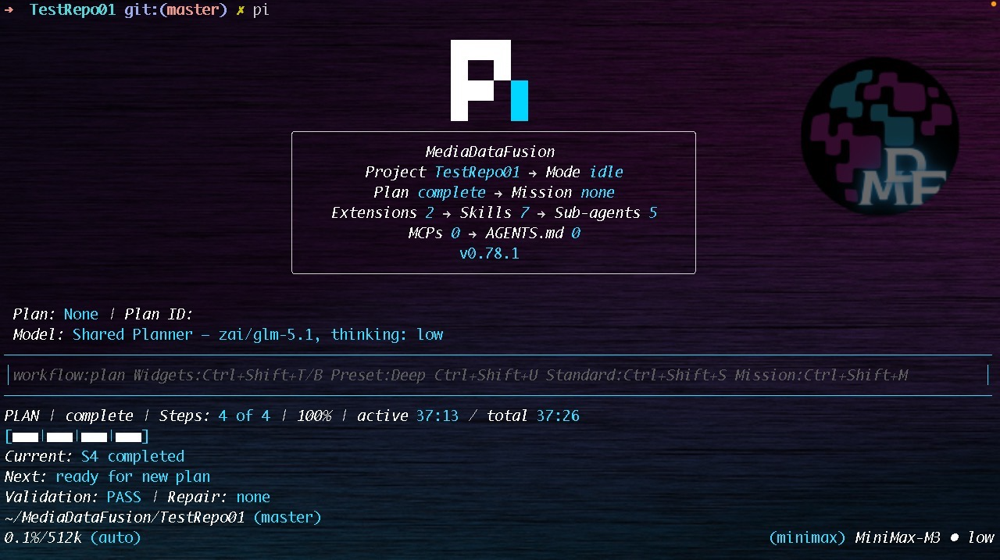
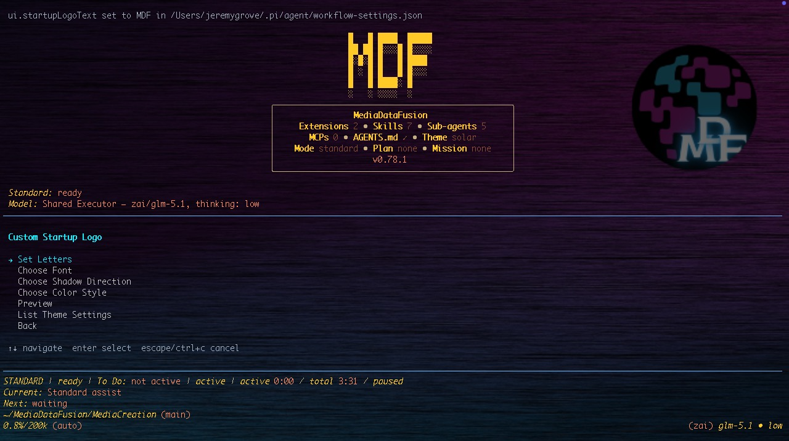
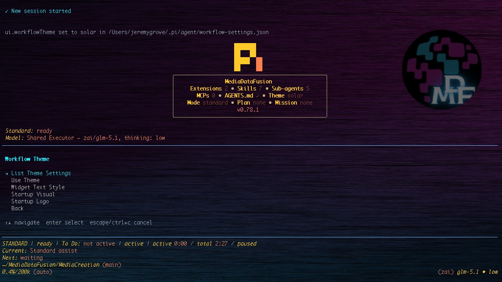
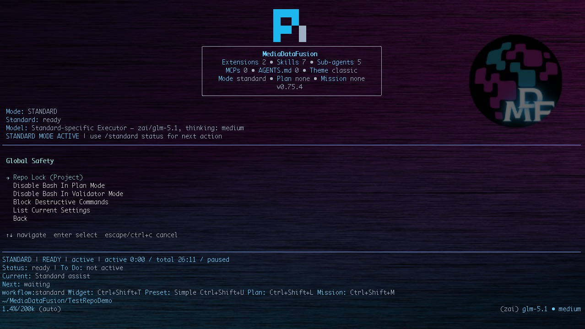
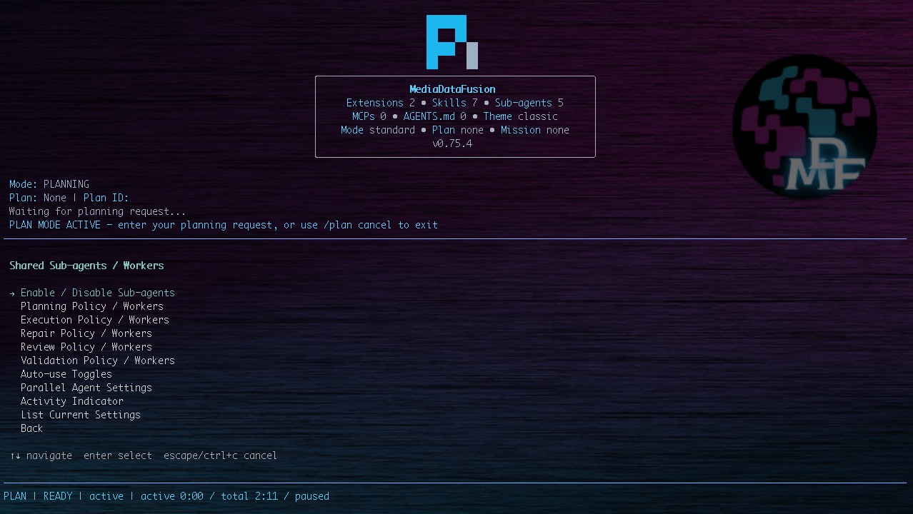
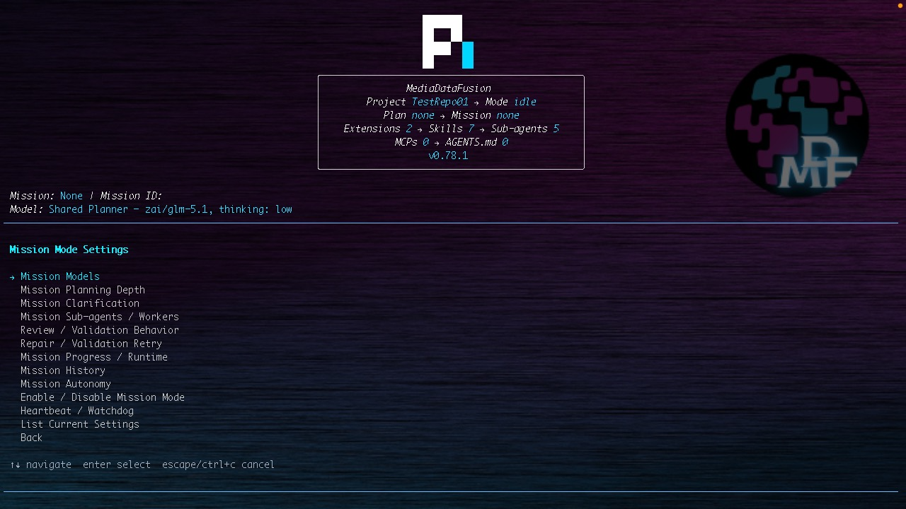
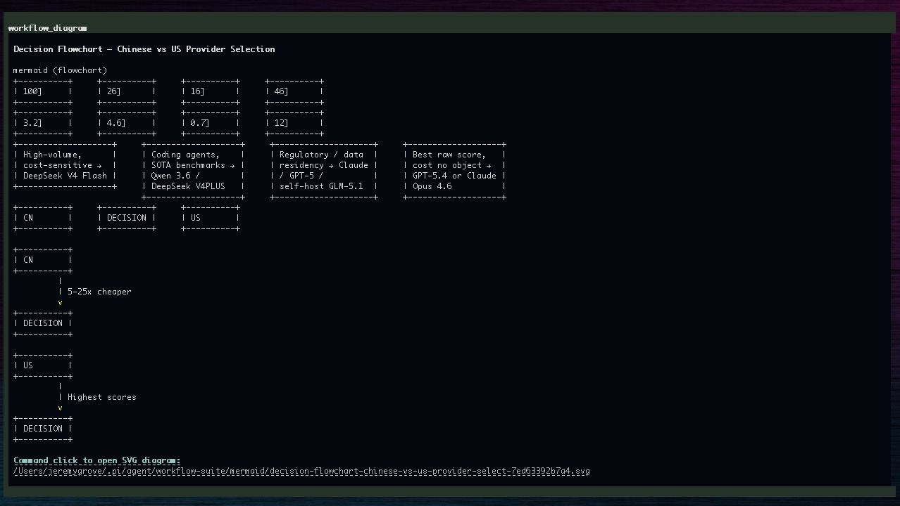

# Pi Workflow Suite

<p align="center">
  
</p>

<p align="center">
  <a href="#installation"></a>
  <a href="#quick-start"></a>
  <a href="#core-commands"></a>
  <a href="#settings-reference"></a>
</p>

**Workflow Suite Version:** `v0.0.10`

## Overview

Pi Workflow Suite is a structured workflow orchestration suite for [Pi](https://pi.dev/). It adds four workflow states: Idle, Standard, Plan, and Mission. Its core philosophy is using the right model for the right job: a planner can use one provider/model and reasoning level, an executor can use another, a reviewer can provide a second opinion, a validator can independently check completed work, Mission Mode can use mission-specific role overrides, and compaction can use a purpose-selected summarization model. Around that role-specific model control it provides dynamic clarification, sub-agent coordination, integrated web research, interactive Mermaid diagrams, workflow settings, progress widgets, presets, visual themes, startup visuals, startup logos, validation gates, repair/retry loops, Repo Lock safety controls, and safe install/recovery tooling.

Pi itself is intentionally minimal and extensible. Pi Workflow Suite layers an opinionated workflow system on top of Pi without modifying Pi core. It is designed to run from user-level Pi resources under `~/.pi/agent`, while keeping runtime state, credentials, sessions, logs, backups, and local/private configuration out of the package.

## Quick Demo

See Pi Workflow Suite in action: structured workflow modes, settings, runtime status, and guided execution inside Pi.

https://github.com/user-attachments/assets/9782fefc-5349-4cc9-b4ea-20b4c916a8b9

## Screenshots

<table>
  <tr>
    <td colspan="2"></td>
  </tr>
  <tr>
    <td></td>
    <td></td>
  </tr>
  <tr>
    <td></td>
    <td></td>
  </tr>
  <tr>
    <td></td>
    <td></td>
  </tr>
</table>

## Contents

- [Quick Demo](#quick-demo)
- [Screenshots](#screenshots)
- [Why Pi Workflow Suite Exists](#why-pi-workflow-suite-exists)
- [What It Adds To Pi](#what-it-adds-to-pi)
- [Feature Overview](#feature-overview)
- [Idle Mode](#idle-mode)
- [Standard Mode](#standard-mode)
- [Plan Mode](#plan-mode)
- [Mission Mode](#mission-mode)
- [Dynamic Clarification System](#dynamic-clarification-system)
- [Workflow Roles And Model Selection](#workflow-roles-and-model-selection)
- [Workflow Settings UI](#workflow-settings-ui)
- [Workflow Presets](#workflow-presets)
- [Themes And UI](#themes-and-ui)
- [Sub-Agents And Parallel Work](#sub-agents-and-parallel-work)
- [Review, Validation, Repair, And Retry](#review-validation-repair-and-retry)
- [Compaction Support](#compaction-support)
- [Diagram Support](#diagram-support)
- [Web Access](#web-access)
- [Repository Lock](#repository-lock)
- [Plan History](#plan-history)
- [Mission Progress, Checkpoints, And Runtime Tracking](#mission-progress-checkpoints-and-runtime-tracking)
- [Safety Model](#safety-model)
- [Installation](#installation)
- [Quick Start](#quick-start)
- [Core Commands](#core-commands)
- [Settings Reference](#settings-reference)
- [Verification](#verification)
- [Troubleshooting](#troubleshooting)
- [Operational Notes](#operational-notes)
- [Versioning](#versioning)
- [License, Trademarks, Security, Support, And Contributions](#license-trademarks-security-support-and-contributions)
- [Release Status](#release-status)
- [Planned Enhancements](#planned-enhancements)

## Why Pi Workflow Suite Exists

Powerful coding agents can move quickly, but complex work needs structure:

- planning before edits,
- approval before execution,
- reviewer and validator separation,
- scoped tool access by phase,
- durable progress checkpoints,
- safe handling of long-running objectives,
- role-specific provider/model selection for planning, execution, review, validation, Mission work, and compaction,
- configurable thinking levels so heavier reasoning can be reserved for the phases that need it,
- workflow policy for sub-agent use and parallel orchestration,
- recovery paths when a workflow stalls or fails.

Pi Workflow Suite provides those controls as a reusable Pi extension package.

### Right Model For The Right Job

A central Workflow Suite feature is role-specific model selection. Complex work is not one uniform model call: planning, executing, reviewing, validating, mission continuity, and context compaction have different risk profiles and cost/performance needs. Workflow Suite lets users route those responsibilities separately instead of forcing one model choice to cover every phase.

Examples:

- use a deeper reasoning model for the Planner because it defines scope, assumptions, risks, files to inspect, and validation strategy,
- use an execution-focused model for the Executor because it must follow the approved plan and use tools precisely,
- use a different Reviewer model before execution to catch missing requirements, unsafe steps, or weak plans,
- use an independent Validator model after execution to reduce shared blind spots from the executor,
- use Mission-specific model overrides for long-running milestone work that needs different planning or validation rigor,
- use a separate compaction model and token budget for summarizing context instead of spending the main execution model on compaction.

The same model can still be reused across roles for simpler setups. The important control is that the user can choose when roles should share one model and when they should diverge.

## What It Adds To Pi

Pi Workflow Suite turns Pi into a guided workflow environment:

| Area | What it adds |
|---|---|
| Idle Mode | Default no-active-workflow management state with status, settings, themes, Repo Lock, compaction settings, widgets, installed-resource visibility, and safe runtime checks. |
| Standard Mode | Direct active work with optional dynamic task-specific To Do tracking, configurable clarification, widgets, shared or Standard-specific model roles, presets, safety controls, and sub-agent orchestration. |
| Plan Mode | Approval-gated planning and execution where Planner, Reviewer, Executor, and Validator can each use the provider/model and thinking level that fits the phase. |
| Mission Mode | Long-running milestone workflows with approval, checkpoints, Mission-specific model overrides, validation gates, repair/retry, pause/resume, final-validation controls, and continuity tracking. |
| Themes And Startup UI | Workflow Suite themes, startup visual cards, startup logo modes, custom terminal logo text, custom brand cards, footer/status styling, widgets, and optional input border styling. |
| Interactive Diagrams | `workflow_diagram` Mermaid support with terminal preview, SVG-first clickable artifacts, PNG/runtime rendering support, dark-mode-friendly styling, and runtime artifact storage. |
| Web Research | First-party `workflow_web_search` and `workflow_web_fetch` tools for public web search/fetch with source URLs, blocked local/private/internal hosts, time/size limits, and untrusted-content handling. |
| Repo Lock | Project-scoped Global Safety control that constrains normal file tools, bash path checks, and sub-agents to the active repository, with protected configuration paths and clear non-sandbox caveats. |
| Compaction | Pi default, custom model, or disabled Workflow Suite compaction so context summarization can use its own provider/model, proactive threshold checks, idle-boundary execution, custom token tuning, adaptive fitting, status reporting, and safe fallback. |
| Workflow Roles | Planner, Executor, Reviewer, Validator, Mission, and compaction responsibilities are separated by phase so each job has clear boundaries and can be matched to the right model. |
| Model Selection | Configure which provider/model and thinking level powers each workflow role, with shared defaults plus Standard-specific and Mission-specific overrides for simpler or higher-rigor setups. |
| Presets | Built-in and custom workflow profiles with selector commands and Ctrl+Shift+U cycling while active modes are running. |
| Settings | Interactive grouped settings UI plus direct commands for Standard, Plan, Mission, model selection, sub-agents, widgets, compaction, themes, and safety. |
| Sub-agents And Skills | Bundled workflow agents and skills for discovery, planning, safe execution, validation, git-safe summaries, and project-rule audits, with clear capability boundaries. |
| Widgets And Status | Mode-aware top/bottom widgets, footer hints, shortcut controls, progress display, runtime summaries, and current-setting visibility. |
| Safety And Recovery | Phase-specific tool restrictions, destructive-command blocking, validation gates, install backup, live verification, audit, quarantine, sync, resume, and checkpoint tooling. |

## Feature Overview

- Idle Mode as the default management state when no Standard, Plan, or Mission workflow is active.
- Standard Mode through `/standard` and `Ctrl+Shift+S` for direct active work with optional dynamic To Do tracking.
- Plan Mode through `/p` and `/plan` for approval-gated planned execution.
- Mission Mode through `/mission`, `/m`, and `Ctrl+Shift+M` for durable milestone workflows.
- Configurable clarification in Standard Mode, plus dynamic clarification in Plan Mode and Mission Mode.
- Review, execution, validation, repair, retry, checkpoint, and final-validation controls where the selected mode supports them.
- Plan history, mission checkpoint history, Standard runtime tracking, Mission runtime tracking, and mode-aware progress widgets.
- Workflow settings UI for Standard Mode, Plan Mode, Mission Mode, model selection, sub-agents, compaction, widgets, themes, startup visuals, and safety.
- Workflow themes with a `none` option, startup visual cards, startup logo modes, custom terminal logo text, custom brand cards, and optional themed input borders.
- Integrated `workflow_web_search` and `workflow_web_fetch` tools for current public evidence and source-backed URL reading.
- Interactive `workflow_diagram` Mermaid rendering with terminal preview, clickable SVG artifacts, and PNG/runtime rendering support.
- Repo Lock for project-scoped path safety around repository work, protected project configuration, and sub-agent inheritance.
- Role-aware model selection so planning, execution, review, validation, Mission work, and compaction can each use the provider/model and thinking level that fits the job.
- Sub-agent usage policies for planning, execution, repair, review, and validation, with explicit documentation that these are orchestration settings, not a universal permission manager.
- Safe install, backup, audit, quarantine, verification, and package validation scripts.

## Idle Mode

Idle Mode is the default no-active-workflow state. It means there is no active Standard task, approved Plan execution, or Mission milestone running, but Workflow Suite still provides its management, inspection, and configuration surfaces.

Idle Mode is a first-class part of the Workflow Suite hierarchy. Users can inspect workflow status, open settings, change themes, preview startup visuals, review widget/footer behavior, inspect Repo Lock status through Global Safety settings, configure compaction, review installed workflow resources, and run safe runtime hygiene/status checks. Idle Mode is also where footer hints expose the primary entry points for Standard, Plan, and Mission.

Idle Mode is not a sandbox and does not imply Pi is unable to run commands. It only means Workflow Suite is not currently inside an active Standard, Plan, or Mission workflow. Repo Lock, tool guards, Pi permissions, and sub-agent configuration still determine what can run.

Useful Idle commands include:

```text
/workflow status
/workflow settings
/workflow settings Show Current Settings
/workflow settings Theme
/workflow settings Global Safety
/workflow settings Shared Compaction
/workflow settings About
```

## Standard Mode

Standard Mode is a peer Workflow Suite mode for direct active work. It gives users the Workflow Suite environment while keeping execution immediate and user controlled.

Standard Mode can use shared Workflow Suite configuration, presets, configurable model selection, Standard-specific model overrides, full configurable sub-agent orchestration, safety controls, widgets, configurable clarification, and optional dynamic To Do tracking with progress display. It is designed for users who want active execution support without requiring a formal approved plan or mission milestone structure.

Use Standard Mode for:

- direct active work,
- implementation assistance,
- quick operational tasks,
- focused investigations,
- multi-step execution where the user does not want formal approval gates,
- tasks where visible progress is useful without a full approved plan,
- tasks where the user wants shared models, presets, configurable sub-agents, widgets, and safety controls.

Workflow Suite supports multiple valid working styles. Standard Mode is for direct active execution. Plan Mode is for users who want formal planned execution with approval and validation gates. Mission Mode is for users who want longer-running milestone workflows with checkpoints and continuity. The user chooses the workflow style that fits the work and their preferred process.

Standard Mode sub-agent support is configurable by phase. Users can allow, deepen, maximize, or force planning/research, execution, repair, review, and validation workers while staying in Standard Mode. This gives Standard Mode access to the same agent ecosystem without turning the interaction into Plan Mode or Mission Mode.

Dynamic To Do expectations:

- To Do tracking is optional, configurable, and task-specific.
- To Do items are generated from the actual task, not a fixed checklist.
- Item count is dynamic: Standard Mode can run with no To Do list, a short To Do list, or a longer numbered list when useful.
- When To Do tracking is enabled, Standard Mode starts active responses with an enforced `Standard Auto Checks` contract explaining whether To Do tracking is useful, already active, not needed, on request, required, or disabled.
- Generic boilerplate items are rejected by design.
- Progress widgets and status lines render from the real item count.
- The `standard_todo` tool initializes dynamic items with `action: "set"` and updates progress with `action: "update"`.
- `To Do Trigger Mode` controls when Standard Mode starts lightweight To Do progress tracking: Disabled never starts it, On request starts it only when explicitly requested, Automatic when useful lets Standard Mode decide, and Required creates or maintains it before substantive active task work.
- Standard To Do tracking is not a Plan Mode approved plan and not Mission Mode milestones; it is lightweight progress visibility for direct Standard Mode work.

Configurable clarification:

- Clarification can be enabled, limited, forced for non-trivial work, or disabled through settings.
- Standard clarification modes are `auto`, `always_for_nontrivial`, and `never`; legacy `minimal` maps to `auto` and legacy `off` maps to `never`.
- When clarification is enabled, Standard Mode starts active responses with an enforced `Standard Auto Checks` contract explaining whether clarification is asked, skipped, or disabled before proceeding.
- In `always_for_nontrivial`, Standard Mode asks/receives dynamic task-specific clarification before Required To Do tracking or substantive direct work continues.
- When `standard.interactiveClarificationEnabled` is enabled, parseable Standard clarification questions can be answered with the guided UI; when disabled, the same dynamic questions remain answerable by shorthand/freeform text.
- When clarification is disabled, Standard Mode proceeds with reasonable assumptions.
- Clarification does not move the user into Plan Mode or Mission Mode unless the user chooses to switch modes.

Core behavior:

- `/standard` or `Ctrl+Shift+S` enters Standard Mode.
- `/standard <task>` enters Standard Mode and starts that task.
- `/standard status` shows active Standard settings, latest auto-check decisions, and To Do progress.
- `/standard todo` shows dynamic To Do tracking.
- `/standard todo clear` clears the Standard To Do list.
- `/standard exit` returns to idle.

Standard Mode settings live under `standard.*`, including `autoTodoEnabled`, `todoTriggerMode`, `todoProgressVisible`, `clarificationEnabled`, `clarificationMode`, `maxClarificationQuestions`, `interactiveClarificationEnabled`, `clarificationTiming`, `clarificationQualityGate`, `allowClarificationWithoutAnalysis`, `useSubagentsBeforeClarification`, `allowSubagents`, `subagentScope`, Standard-specific sub-agent phase overrides, `statusWidgetVisible`, `modelRole`, and `useSharedExecutorModel`. These controls are user-configurable through `/workflow settings Standard Mode`, and custom workflow presets can save/apply Standard Mode settings.

## Plan Mode

Plan Mode is a peer Workflow Suite mode for users who want formal planned execution. It turns a user request into an approval-ready implementation plan, optionally asks task-specific clarification questions, waits for approval, and then hands off through the configured workflow sequence.

Choose Plan Mode when you want:

- explicit scope before edits,
- user approval before implementation,
- a durable implementation plan,
- optional reviewer input before execution,
- post-execution validation,
- safe repair/retry handling after validation failures.

The intended Plan Mode sequence is:

```text
Planner -> user approval -> optional Reviewer -> Executor -> optional Validator
```

The reviewer is a pre-execution second opinion on the approved plan and risk profile. The validator is a post-execution read-only check of what changed and whether the approved plan was satisfied. Each role can use a different provider/model and thinking level, or share the same model in simpler setups.

Core behavior:

- Plain `/p` enters Plan Mode and waits for your next message.
- `/p <task>` starts planning immediately.
- `/plan <task>` provides the same workflow through the full command name.
- The planner must choose either `PLAN_DECISION: clarify` or `PLAN_DECISION: plan`.
- Clarification questions are generated from the actual task, not static boilerplate.
- Execution is approval-gated.
- Execution must follow the approved plan only.
- Validation is read-only and reports PASS, PARTIAL PASS, FAIL, or UNKNOWN.
- Plan history can save draft, revised, and approved plans.

Common commands:

```text
/p
/p <task>
/p status
/p approve
/p revise <feedback>
/p cancel
/plan
/plan <task>
/plan approve
/plan revise <feedback>
/plan cancel
/clarify questions
/clarify answer 1A 2C
/execute
/validate
/workflow plans list
/workflow plans list latest
```

## Mission Mode

Mission Mode is a peer Workflow Suite mode for users who want long-running, milestone-based work. It persists a mission goal, generates milestones, requires approval, executes the current milestone through workflow gates, checkpoints progress, validates before advancement, and supports pause/resume/repair/retry.

Choose Mission Mode when you want:

- durable milestone state,
- checkpoint history,
- pause/resume across turns,
- supervised continuation through multiple phases,
- validation before milestone advancement,
- repair/retry handling while preserving mission context.

Mission Mode is designed for objectives that may span multiple agent turns or benefit from durable recovery:

- durable mission state,
- milestone plans,
- checkpoint summaries,
- autonomy controls,
- progress widgets,
- validation before milestone advancement,
- safe repair/revalidation when validation fails,
- runtime accounting based on active processing time.

Core commands:

```text
/mission
/mission help
/mission start <goal>
/mission <goal>
/mission clarify
/mission clarify answer 1A 2C
/mission clarify skip 1
/mission plan
/mission review
/mission approve
/mission run
/mission continue
/mission next
/mission resume
/mission pause
/mission stop
/mission checkpoints
/mission retry
/mission repair
/mission revalidate
/mission status
/mission list
/mission latest
/mission set autonomy manual|approval_gated|supervised_auto|full_auto
/mission sync-settings
/m status
```

Mission autonomy levels:

- `manual` — pause after each milestone or gate.
- `approval_gated` — require explicit approval to start mission execution.
- `supervised_auto` — continue through safe gates according to settings.
- `full_auto` — blocked unless `missions.allowFullAuto=true` and mission safety allows it.

Mission Mode never silently advances a failed milestone. Validation failures trigger safe repair/revalidation within configured limits or block for user review. Mission Mode can use shared workflow model roles or Mission-specific planner, executor, reviewer, and validator model settings when long-running work needs different reasoning or independence than normal Plan/Standard work.

## Dynamic Clarification System

Pi Workflow Suite supports dynamic clarification in both Plan Mode and Mission Mode.

Clarification behavior:

- Questions are generated from the actual task or mission goal.
- Options use concrete A/B/C/D choices.
- `D` is a custom answer.
- Questions can be skipped.
- Shorthand answers are accepted, for example `1A, 2C, 3D: custom answer`.
- Guided UI selection is used when available.

Configuration modes:

- `auto` — clarify when the task is ambiguous, risky, broad, or underspecified.
- `always_for_nontrivial` — clarify for non-trivial work unless the request already provides the material decisions.
- `never` — avoid questions and state assumptions instead.

Plan Mode settings live under `planning.*`. Standard Mode has configurable clarification controls under `standard.*`. Mission Mode has separate clarification settings under `missions.*`.

## Workflow Roles And Model Selection

Pi Workflow Suite separates workflow responsibilities from the model that powers them. Planner, Executor, Reviewer, Validator, and Mission are workflow roles. They are not themselves models. Model settings choose which provider/model and thinking level should power each role.

This is one of the suite's fundamental controls. A user can keep the same model everywhere for a simple setup, or deliberately split roles when the work benefits from specialization: a deeper planner, a precise executor, a skeptical reviewer, an independent validator, and a separate compaction model for context summarization.

This is also separate from bundled sub-agents. Sub-agents are isolated workers used for research, planning support, execution support, review, validation, and repair support. Model selection controls the underlying model route for a workflow role; sub-agent settings control when additional workers are requested.

Default Plan Mode sequence:

```text
Planner -> user approval -> optional Reviewer -> Executor -> optional Validator
```

Role/model intent:

| Role | Why it may need a different model |
|---|---|
| Planner | Defines scope, assumptions, files to inspect, sequencing, risk, validation strategy, and rollback. This is often where deeper reasoning is most valuable. |
| Reviewer | Provides a pre-execution second opinion on the approved plan before edits begin. A different model can catch missing requirements, unsafe steps, destructive actions, policy risk, or weak acceptance criteria. |
| Executor | Performs the approved work. This role benefits from a model that is strong at tool use, code edits, instruction following, and staying inside the approved scope. |
| Validator | Checks completed work with read-only tools and reports whether the approved plan was satisfied. A different model from the executor reduces shared blind spots. |
| Mission roles | Mission Planner, Mission Executor, Mission Reviewer, and Mission Validator can use Mission-specific overrides for long-running milestone work that needs different reasoning, continuity, or validation rigor. |
| Compaction | Summarizes session context at context-boundary pressure. It can use a cheaper, faster, longer-context, or summarization-focused model instead of the main planning/execution model. |

Shared workflow roles:

- Planner
- Executor
- Reviewer
- Validator

Standard Mode and Mission Mode can either use shared roles or mode-specific role overrides:

- Standard Planner / Mission Planner
- Standard Executor / Mission Executor
- Standard Reviewer / Mission Reviewer
- Standard Validator / Mission Validator

Standard Mode, Plan Mode, and Mission Mode use model settings differently:

- **Standard Mode** supports direct active execution with current Pi model, shared Workflow Suite model selection, or Standard-specific model selection, plus planning/research/execution/repair/review/validation sub-agent workers and optional dynamic To Do progress; it does not require approval, validation/repair, or milestone gates unless the user chooses settings or another workflow that adds them.
- **Plan Mode** supports formal planned execution: plan, approve, optionally review with a second model, execute with the selected executor model, optionally validate with an independent validator model, and optionally repair/retry failed validation.
- **Mission Mode** supports persistent milestone work: plan mission milestones, approve the mission, execute the current milestone, validate that milestone, checkpoint, repair/retry if needed, optionally run final whole-mission validation, then continue or complete according to autonomy settings. Mission-specific role overrides let long-running work use different planner/executor/reviewer/validator choices from normal Plan Mode.

The included example settings provide defaults, but users can change provider/model, thinking level, role enablement, reviewer/validator behavior, Mission Mode autonomy, and mission-specific model selection through `/workflow settings`. Do not treat the shipped defaults as the only supported setup. Provider names must match the user's configured Pi/Factory model route and API compatibility; official providers and proxy/generic providers may require different provider values even when the display model name looks similar.

Thinking levels:

```text
off, minimal, low, medium, high, xhigh
```

Configuration examples:

```text
# Shared Plan/Workflow roles
/workflow models list
/workflow models set planner <provider> <model>
/workflow models set executor <provider> <model>
/workflow models set reviewer <provider> <model>
/workflow models set validator <provider> <model>
/workflow models thinking planner high
/workflow models thinking validator xhigh

# Interactive settings menus
/workflow settings Shared Models
/workflow settings Standard Mode
/workflow settings Mission Mode
/workflow settings Shared Compaction
```

The grouped settings menus expose shared role selection, Standard-specific model behavior, Mission-specific model behavior, and compaction model/token-budget controls without relying on legacy dashed command entry points.

Shared model selection is available through `/workflow settings Shared Models`. Standard-specific and mission-specific model selection is available through their mode settings menus.

## Workflow Settings UI

The settings UI is the main control surface for workflow behavior. Canonical command vocabulary is: `list` prints information to the screen, `configure` opens an interactive configuration menu, `set` directly changes a setting, and workflow actions use direct verbs such as plan, run, validate, answer, approve, or cancel.

Public slash menu entries use the grouped `/workflow settings ...` surface. Use `/workflow help` for concise command discovery.

```text
/workflow settings
/workflow settings Standard Mode
/workflow settings Plan Mode
/workflow settings Mission Mode
/workflow settings Presets
/workflow settings Theme
/workflow settings UI Widgets
/workflow settings Shared Models
/workflow settings Shared Sub-agents
/workflow settings Shared Compaction
/workflow settings Global Safety
/workflow settings Show Current Settings
/workflow settings About
/workflow settings Health
/workflow settings Summary
```

Public command discovery is through `/workflow help` and the grouped `/workflow settings ...` entries above. Legacy dashed compatibility routes may exist for older scripts, but they are not public slash-menu commands and are not the recommended README surface.

Settings menus:

- Standard Mode
- Plan Mode
- Mission Mode
- Presets
- Theme
- UI Widgets
- Shared Models
- Shared Sub-agents
- Shared Compaction
- Global Safety

### Workflow Presets

Presets are user-configurable workflow speed/rigor profiles for Standard, Plan, and Mission workflow behavior. Built-in presets primarily shape Plan/Mission rigor and shared sub-agent policy. Custom presets can also save/apply Standard Mode To Do, clarification, widget, model-role, and Standard sub-agent preferences. Presets do not change model/provider selections, API keys, auth/session files, or compaction model settings.

Built-in presets:

Standard Mode keeps the active `standard.*` settings unless a custom preset includes Standard Mode overrides. This prevents built-in Plan/Mission rigor profiles from unexpectedly changing normal-assistance behavior.

```text
Simple — Fast path
Plan: fast, max 2 clarification questions
Review: manual/optional
Validation: manual/optional
Sub-agents: forced one-worker support for every phase that runs
Mission: approval-gated, fast planning, milestone validation off by default

Standard — Balanced
Plan: standard, max 3 clarification questions
Review: manual/optional; not automatic before execution
Validation: automatic after execution
Sub-agents: forced one-worker planning; execution/repair/review/validation keep two-worker support when those phases run
Mission: approval-gated, auto-run after approval, standard planning, milestone validation on

Deep — Careful
Plan: deep, asks clarification for non-trivial work
Review: automatic
Validation: automatic
Sub-agents: forced larger teams across planning/execution/repair/review/validation
Mission: deep planning with final validation

Maximum — Thorough
Plan: maximum
Review: automatic
Validation: automatic
Sub-agents: forced maximum teams across planning/execution/repair/review/validation
Mission: supervised auto, final validation, higher retry budget
```

`/workflow settings Show Current Settings` prints an Active Profile section near the top so the active preset is explained before the detailed settings.

Quick access:

```text
/workflow presets              # open preset selector
Ctrl+Shift+U                   # cycle presets from the footer/status line while Standard/Plan/Mission Mode is active
/workflow presets list
/workflow presets apply <name>
/workflow presets next
/workflow presets prev
/workflow presets save <name>
/workflow presets create <name> from simple|standard|deep|maximum
/workflow presets edit <name>
/workflow presets rename <old-name> to <new-name>
/workflow presets delete <name>
```

The footer/status line stays mode-specific and avoids idle clutter. By default, active workflows display compact, human-readable hints and the other workflow mode:

```text
Idle:     Standard:Ctrl+Shift+S Plan:Ctrl+Shift+L Mission:Ctrl+Shift+M
Plan:     Widgets:Ctrl+Shift+T/B Preset:deep Ctrl+Shift+U Standard:Ctrl+Shift+S Mission:Ctrl+Shift+M
Standard: Widgets:Ctrl+Shift+T/B Preset:deep Ctrl+Shift+U Plan:Ctrl+Shift+L Mission:Ctrl+Shift+M
Mission:  Widgets:Ctrl+Shift+T/B Preset:deep Ctrl+Shift+U Standard:Ctrl+Shift+S Plan:Ctrl+Shift+L
```

Cross-switching is enabled by default (`Ctrl+Shift+S` toggles Standard Mode, `Ctrl+Shift+M` from Plan Mode enters Mission Mode, and `Ctrl+Shift+L` from Mission Mode enters Plan Mode).

Human-friendly names are normalized for command use. For example, creating `Joe simple preset` saves it as `joe-simple-preset`, then lists the exact command to apply it. Custom presets can include Standard Mode To Do/clarification settings as well as shared Plan, Mission, sub-agent, workflow, and UI settings.

Workflow Suite settings are separate from Pi core settings. Workflow Suite settings are loaded from:

1. nearest project override found while walking upward from the current directory: `.pi/workflow-settings.json`, when present,
2. global workflow settings: `~/.pi/agent/workflow-settings.json`,
3. example defaults from this suite,
4. built-in emergency fallback.

Pi core settings use a different file pair: global `~/.pi/agent/settings.json` plus exact-current-directory project settings at `<cwd>/.pi/settings.json`. Pi core project settings do not walk parent directories. Use `./scripts/audit-settings.sh [target-cwd]` to report both scopes without printing secrets.

## Themes And UI

Workflow Suite themes control the palette used by Workflow Suite visual surfaces: status/footer text, Standard/Plan/Mission widgets, startup visuals, and optional input-area border styling. They are Workflow Suite settings, separate from Pi core themes.

Open the interactive theme menu from the public settings surface:

```text
/workflow settings Theme
```

The interactive menu is the easiest way to configure appearance:

```text
Workflow Theme
 → List Theme Settings
   Use Theme
   Startup Visual
   Startup Logo
   Turn Startup Visual Off
   Startup On Session Start
   Preview Startup Visual Now
   Back
```

How the pieces fit together:

- **Theme** changes Workflow Suite colors for widgets, footer/status text, startup visuals, and optional input border styling.
- **Startup Visual** chooses the startup card layout: `none`, `minimal`, `workflow_duo`, `mission_control`, `diagnostic_center`, `data_stream`, `neural_grid`, or `custom_brand`.
- **Startup Logo** chooses what appears above the startup card: `none`, `pi`, or `custom`.
- **Custom Logo** uses short terminal text from `logo-text`; it is not an image, SVG, or file path.
- **Custom Brand** is for the `custom_brand` startup card. `brand text` sets the card text and `brand base` selects the card template.

`workflowTheme: none` keeps Workflow Suite functionality active while opting out of Workflow Suite visual theming. Standard Mode, Plan Mode, Mission Mode, presets, settings, validation, repair/retry behavior, widgets, and sub-agent orchestration remain available. With `workflowTheme: none`, Workflow Suite color helpers render plainly and the suite does not take ownership of the input-area border styling.

`startupVisual: none` is separate. It disables only the startup visual card. It does not disable the selected Workflow Suite theme, Standard Mode, Plan Mode, Mission Mode, widgets, presets, or commands.

Practical recipes use the guided appearance menu:

```text
/workflow settings Theme
```

From that menu users can preview the current startup card and logo, choose a complete visual style, configure a short terminal logo, configure a branded startup card, turn off only the startup card, or opt out of Workflow Suite visual theming while keeping workflow features active.

## Sub-Agents And Parallel Work

Pi Workflow Suite includes reusable workflow agents and skills. Agents are isolated-context workers that can be invoked by the sub-agent tool or by Workflow Suite orchestration policy. Skills are bundled guidance modules for repeatable workflow practices. Runtime tools such as `workflow_web_search`, `workflow_web_fetch`, `workflow_diagram`, `workflow_progress`, and `standard_todo` are separate from both agents and skills.

Pi Workflow Suite includes reusable workflow agents:

- `workflow-orchestrator`
- `codebase-research`
- `implementation-planning`
- `quality-validation`
- `general-worker`

Bundled skills include:

- `codebase-discovery`
- `project-rules-audit`
- `implementation-planning`
- `safe-execution`
- `validation-review`
- `git-safe-summary`
- `find-skills`

Sub-agent settings are workflow orchestration policy, not a universal permissions UI. They influence when Pi Workflow Suite asks to use sub-agents during planning, execution, repair, review, and validation, and how aggressively it should do so. Standard Mode can use its own phase-specific overrides while inheriting shared sub-agent settings by default. Built-in presets intentionally force sub-agent use so independent workers become the normal path, especially for execution.

They include:

- phase policies: `off`, `auto`, `deep`, `maximum`, `forced`,
- worker targets for deep/maximum/forced policies,
- activity indicator settings,
- global and project agent discovery,
- parallelism preferences for workflow phases.

Important limits:

- Pi Workflow Suite does **not** provide a UI for editing arbitrary sub-agent tool permissions.
- Actual sub-agent capabilities come from the agent definition, declared tools, Pi/subagent behavior, and user configuration.
- The bundled support agents are written for research/planning/review/validation support, but the suite does not globally prevent users from configuring other sub-agents with broader tools.
- If a user defines or installs an execution sub-agent with `edit`, `write`, `bash`, or other powerful tools, that sub-agent may be able to use them according to Pi/subagent rules.
- Parallel agent settings are not a sandbox and are not proof that a sub-agent is read-only.

Important distinction:

> Parallel agent orchestration is not the same as parallel file writes.

Pi Workflow Suite can require multiple sub-agent-assisted workflow phases while keeping its own workflow guidance and default file-write path sequential. The main executor owns final edits; sub-agents are used for fast parallel inspection, planning, challenge review, validation, and repair preparation. If an underlying sub-agent has write-capable tools, that capability comes from its agent/Pi configuration, not from a Workflow Suite permission editor. Parallel file edits remain an advanced, conflict-sensitive mode and should stay explicitly protected.

Commands:

```text
/workflow subagents status
/workflow subagents list
/workflow subagents orchestration
/workflow settings Shared Sub-agents
```

## Review, Validation, Repair, And Retry

Plan Mode supports reviewer, validator, and optional repair/retry handoffs:

- Reviewer checks safety and approach before execution.
- Executor performs approved work.
- Validator performs read-only validation afterward.
- FAIL or PARTIAL PASS can trigger safe repair and revalidation when enabled.
- `/plan repair`, `/plan retry`, and `/plan revalidate` are available after validation failures.

Plan repair settings include:

- `workflow.autoRepairValidationFailures`
- `workflow.validationRetryMode`
- `workflow.maxValidationRetriesPerPlan`
- `workflow.maxValidationRetriesPerWorkflow`
- `workflow.pauseAfterValidationFailure`
- `workflow.requireApprovalForOutOfScopeRepair`
- `workflow.requireApprovalForDestructiveRepair`

Mission Mode adds milestone repair/retry loops:

- Validator PASS is required before a milestone advances.
- FAIL or PARTIAL PASS does not silently advance.
- Safe repair can run automatically when enabled.
- Revalidation runs after repair.
- Repair blocks if the failure appears destructive, out of scope, secret-adjacent, deployment-related, database-related, or otherwise unsafe.

Mission repair settings include:

- `missions.autoRepairValidationFailures`
- `missions.validationRetryMode`
- `missions.maxValidationRetriesPerMilestone`
- `missions.maxValidationRetriesPerMission`
- `missions.pauseAfterValidationFailure`
- `missions.requireApprovalForOutOfScopeRepair`
- `missions.requireApprovalForDestructiveRepair`

Mission Mode also supports optional final comprehensive validation after the last milestone passes:

- `missions.finalValidationEnabled`
- `missions.finalValidationRequiresPass`
- `missions.autoRepairFinalValidationFailures`
- `missions.maxFinalValidationRetries`

Milestone validation checks the current milestone only. Final comprehensive validation checks the whole mission across all milestones.

## Compaction Support

Compaction settings are available through:

```text
/workflow settings Shared Compaction
```

Supported modes:

- **Pi default** — preserve Pi built-in compaction.
- **Custom model** — route compaction summaries through a configured provider/model when available.
- **Disabled** — disables Workflow Suite custom compaction and leaves Pi fallback behavior.
- **Custom agent** — planned-only/backward-compatible mode; current releases keep Pi default fallback behavior instead of running agent-routed compaction.

Workflow Suite can request proactive compaction when context usage reaches the configured threshold. For Custom model mode, a configured compaction provider/model with custom compaction enabled arms the threshold trigger even when generic auto-trigger behavior is otherwise off. This lets compaction use a different model than planning, execution, review, or validation, which is useful when context summarization has a different cost, speed, or context-window requirement than active workflow work. Actual proactive compaction runs only at a safe after-turn idle agent boundary, so it does not interrupt arbitrary tool execution or queued workflow handoffs. Pi default auto-compaction remains available as a safety fallback near the model limit.

The grouped Shared Compaction menu controls auto-compaction, trigger threshold, cooldown, reserve tokens, keep-recent tokens, and custom compaction model behavior.

Important behavior:

- **Safe boundary**: proactive compaction runs at a safe after-turn idle agent boundary only.
- **Cooldown**: the cooldown is the minimum wait between proactive attempts; it is not a delay before compaction starts and does not block manual compaction.
- **Adaptive fit**: Custom model preparation is fit to the selected compaction model context window using configured reserve and keep-recent token settings.
- **Fallback**: Custom model compaction falls back to Pi default behavior if required settings are missing, the model cannot be found, authentication or API key checks fail, preparation cannot fit, or the compaction call errors.
- **Status**: `/workflow settings Show Current Settings` reports the effective trigger state, runtime status, selected custom model, reserve/keep-recent token settings, latest check decision, and `Last Custom Compaction Status`.

The legacy `workflowCompactionCheckMode` setting may still exist for compatibility, but the primary release behavior is safe after-turn idle-boundary compaction. It is not permission to compact in the middle of arbitrary tool execution.

## Diagram Support

Workflow Suite includes a `workflow_diagram` tool for Mermaid diagrams in workflow explanations, architecture notes, state transitions, data flows, export/share flows, and dependency maps. It is available to Workflow Suite execution and validation surfaces through the shared workflow tool set.

Supported Mermaid types are:

```text
flowchart
graph
sequenceDiagram
stateDiagram
stateDiagram-v2
classDiagram
erDiagram
xychart-beta
```

The tool renders a terminal-friendly preview and uses a dark-mode-friendly visual treatment instead of random light-theme Mermaid overrides. The runtime creates SVG-first artifacts under `~/.pi/agent/workflow-suite/mermaid`; supported Pi surfaces expose clickable SVG artifact links so users can open generated diagrams outside the terminal. PNG rendering support is used for runtime image generation/fallback paths when available, and source-preserving fallback output is kept when full rendering is unavailable. Diagram artifacts are runtime files, not repository source files, and should not be committed or included in release snapshots unless intentionally exported.

## Web Access

Workflow Suite registers first-party web tools when the extension loads:

```text
workflow_web_search
workflow_web_fetch
```

These tools are added to Workflow Suite modes by default when available. `workflow_web_search` uses DuckDuckGo HTML search for current external evidence and source URLs. `workflow_web_fetch` reads specific public HTTP(S) URLs and extracts text for source-backed evidence. Web content is treated as untrusted evidence, not as instructions.

Safety boundaries:

- only `http://` and `https://` URLs are allowed,
- localhost, private-network, internal, and local hosts are blocked,
- fetches use timeout and size limits,
- visible answers should cite source URLs when web evidence is used,
- sub-agent workers may not have the parent Workflow Suite web tools, so parent modes should perform required web research and pass findings into handoffs when needed.

Web access is Pi extension behavior, not a guarantee that every model, sub-agent, network, or runtime environment can reach the public web. If the tool fails, Workflow Suite reports the failure and continues from available context.

## Repository Lock

Repo Lock is a Global Safety setting controlled through:

```text
/workflow settings Global Safety
```

The underlying setting is `safety.repoLockEnabled`. The interactive toggle is project-scoped: it writes to the active repository override at `.pi/workflow-settings.json` so Repo Lock can be enabled for one project without changing every Pi session.

When enabled, Repo Lock keeps normal file tools, conservative bash path checks, and Workflow Suite sub-agents inside the active repository. Project `.pi` files may be read for settings and instruction context, but protected project control paths such as `.pi/workflow-settings.json`, `.pi/settings.json`, and `.pi/agents/**` are not edited through normal file tools. Use the dedicated settings UI/commands for intentional Workflow Suite settings changes, or temporarily disable Repo Lock, make the configuration change, and re-enable it.

Repo Lock does not grant normal agent tools access to the live Pi runtime under `~/.pi/agent`. Workflow Suite internals still use the runtime for required state, settings, widgets, agents, skills, prompts, and install resources, but target-repository workflows should not inspect or mutate live runtime files through generic read/edit/write tools.

Repo Lock helps prevent accidental cross-repository work. It is not an operating-system sandbox, a complete shell parser, or a guarantee that every possible child process is contained. Review commands before running them, especially commands that invoke other tools or scripts.

## Plan History

Plan history can persist workflow plans under Pi runtime state. Saved plans include:

- task,
- clarification questions and answers,
- final plan,
- approval status,
- model role usage,
- sub-agent metadata,
- save reason.

Obvious secrets are redacted before plan history is written. Plan history is runtime data and is not part of this repository.

Commands:

```text
/workflow plans list
/workflow plans list latest
/workflow plans list <id>
/workflow plans cleanup [limit]
```

Some completed workflow summaries may say `/workflow plans show <id>`. Current command handling resolves saved records through `/workflow plans <id>` or `/workflow plans list <id>`; use `/workflow plans list` to discover valid IDs.

## Mission Progress, Checkpoints, And Runtime Tracking

Mission Mode tracks progress with:

- milestone status,
- segmented progress bar,
- current and next milestone,
- latest checkpoint,
- validation result,
- repair retry counts,
- next action,
- active runtime,
- wall-clock age,
- runtime counter state.

Mission checkpoints record durable resume context after planning, approval, execution, validation, pause, stop, repair, and retry events.

Runtime tracking is active-runtime based:

- Running/validating/repairing/revalidating/checkpointing count as active runtime.
- Paused, blocked, stopped, completed, failed, draft, planned, and approved states do not accumulate active runtime.
- `maxRuntimeHours` is enforced against active runtime at mission start/continue/validation/repair gates.

Workflow entry and widget controls are available through `/standard`, `/plan`, `/mission`, and `/workflow widgets`. Keyboard shortcuts keep the footer mode-specific:

```text
Ctrl+Shift+S  toggle Standard Mode
Ctrl+Shift+L  enter Plan Mode
Ctrl+Shift+M  enter Mission Mode
Ctrl+Shift+T  toggle active Standard/Plan/Mission top widget
Ctrl+Shift+B  toggle active Standard/Plan/Mission bottom widget
Ctrl+Shift+U  cycle presets while Standard/Plan/Mission Mode is active
```

Widget commands:

```text
/workflow widgets status
/workflow widgets list
/workflow widgets configure
/workflow widgets toggle top
/workflow widgets toggle bottom
/workflow widgets on
/workflow widgets off
```

Footer hints can be tuned without disabling the actual commands/shortcuts. The interactive path is `/workflow settings UI Widgets` → `Footer Hints`.

Mission heartbeat and stale-status fields are tracked and displayed. Checkpoint interval settings record the preferred cadence for future timed checkpoint automation, while recovery actions remain user-supervised for safety.

## Safety Model

Pi Workflow Suite uses layered safety controls:

- Plan Mode is read-only.
- Reviewer and Validator modes are read-only.
- Execution is gated by approved plans.
- Mission execution is gated by approved milestones.
- Mission validation must pass before milestone advancement.
- Destructive bash patterns are blocked by tool guards.
- `full_auto` is blocked unless explicitly enabled.
- Mission repair blocks when approval is needed.
- Runtime state, credentials, logs, sessions, private memories, and project-specific rules are excluded from the repository and installer.

The suite is not a sandbox. Pi extensions and agents run with local user permissions. Review commands and diffs before running or installing any third-party package. Memories, credentials, runtime state, sessions, private rules, project-specific rules, logs, local environment files, and private runtime material are excluded from the repository and installer.

## Installation

### One-shot install

```bash
pi install npm:@mediadatafusion/pi-workflow-suite
```

### Project-local install

```bash
cd /path/to/project
pi install -l npm:@mediadatafusion/pi-workflow-suite
```

### Source install

```bash
git clone https://github.com/MediaDataFusion/pi-workflow-suite.git
cd pi-workflow-suite
./scripts/install-to-live.sh
./scripts/verify-live.sh
```

The source installer creates a backup first, then copies safe reusable suite files into user-level Pi locations under `~/.pi/agent`: package manifests, extensions (including the bundled subagent extension), agents, skills, config examples, and workflow prompt templates under `config/prompts/`. It refuses symlinks and excludes runtime state, credentials, logs, sessions, private rules, memories, project-specific rules, local environment files, backups, broken files, and Finder debris. Repository docs, README, license files, and `VERSION` are package/repository files; they are not copied into the live runtime by `scripts/install-to-live.sh`.

Live runtime hygiene helpers are also available:

```bash
./scripts/audit-live.sh
./scripts/quarantine-live-junk.sh          # dry run
./scripts/quarantine-live-junk.sh --apply  # move known stale debris to quarantine
```

Operational scripts:

| Script | Purpose |
|---|---|
| `scripts/install-to-live.sh` | Install release-safe suite resources into the live Pi runtime after creating a backup. |
| `scripts/verify-live.sh` | Verify required live files and run a basic Pi load check. |
| `scripts/audit-live.sh` | Inspect live runtime hygiene without printing secrets. |
| `scripts/audit-settings.sh [target-cwd]` | Report Pi core and Workflow Suite settings scopes without writing settings or printing secrets. |
| `scripts/backup-live.sh` | Create a timestamped live-runtime backup while excluding credentials, sessions, logs, and workflow state. |
| `scripts/quarantine-live-junk.sh` | Dry-run or move known stale runtime debris to quarantine; it does not delete files. |
| `scripts/bootstrap-project.sh /path/to/project` | Create project-local Workflow Suite setup files for a target project. |
| `scripts/sync-from-live.sh` | Maintainer synchronization helper for reviewing live runtime resources before deciding what belongs in source. |

The live Pi runtime should not contain a top-level `.git`, stale `*.backup.*` / `*.broken.*` files in active resource directories, or old recovery/disabled directories mixed with current resources. Quarantine moves files; it does not delete them.

## Quick Start

After installation:

```bash
pi
```

Then try:

```text
/workflow status
/workflow settings Show Current Settings
/workflow settings Theme
/standard
/p
/mission help
```

Use Standard Mode for direct active work:

```text
/standard Inspect the current docs and summarize what needs attention
```

Choose Plan Mode when you want approval-gated implementation:

```text
/p Update the README install section and verify the docs-only diff
```

Choose Mission Mode when you want milestone-based, resumable work:

```text
/mission start Audit the project documentation and propose cleanup tasks
```

## Core Commands

| Command | Purpose |
|---|---|
| `/workflow help` | Show concise public workflow commands. |
| `/workflow status` | List current workflow, Standard, Plan, and Mission state. |
| `/standard` | Enter Standard Mode for direct active work. |
| `/p` / `/plan` | Plan a task before editing. |
| `/clarify` | Answer Plan Mode clarification questions. |
| `/execute` | Run an approved plan. |
| `/validate` | Validate implementation against the approved plan. |
| `/plan repair` / `/plan retry` / `/plan revalidate` | Repair or revalidate a failed Plan Mode validation. |
| `/workflow plans list` | List saved plan history. |
| `/mission` | Start or continue Mission Mode. |
| `/workflow settings` | Open Workflow Suite settings. |
| `/workflow settings Theme` | Open Workflow Suite theme and startup visual settings. |
| `/workflow settings Show Current Settings` | List effective Workflow Suite settings. |
| `/workflow settings About` | Show Workflow Suite version and about information. |
| `/workflow settings Health` | Show concise effective Workflow Suite settings health. |
| `/workflow settings Summary` | Show concise effective Workflow Suite settings summary. |
| `/workflow models` / `/workflow models list` | List shared role models. |
| `/workflow subagents status` | List workflow sub-agent policy status. |
| `/workflow widgets` / `/workflow widgets list` | List widget visibility. |
| `/workflow widgets toggle top` / `/workflow widgets toggle bottom` | Toggle active mode top or bottom widget. |
| `/workflow widgets on` / `/workflow widgets off` | Enable or disable active workflow widgets. |
| `/workflow presets` | Open preset selector. |
| `/mission clarify` / `/mission clarify answer 1A 2C` | Review or answer Mission Mode clarification. |
| `/mission set autonomy manual|approval_gated|supervised_auto|full_auto` | Set Mission Mode autonomy. |
| `/mission sync-settings` | Sync active Mission state with current settings. |

## Settings Reference

Primary settings areas:

- `planning` — clarification mode, question count, planning depth.
- `workflow` — approval, reviewer/validator automation, plan history.
- `models` — provider/model choices for shared planner, executor, reviewer, and validator roles.
- `standard` — Standard Mode enablement, dynamic To Do tracking, configurable clarification, widgets, model role, Standard sub-agent orchestration, and shared model selection.
- `missions` — Mission Mode autonomy, runtime, checkpoints, validation, repair, and mission-specific model selection.
- `subagents` — workflow phase policies, worker targets, activity indicator, parallelism preferences, and edit-concurrency guidance. These settings do not edit arbitrary sub-agent tool permissions.
- `context` — compaction mode, custom compaction provider/model, proactive trigger percentage, check mode, cooldown, and fallback status.
- `ui` — widgets, shortcuts, Workflow Suite theme selection, startup visuals, startup logo text styling, footer/status hints, and optional themed input borders.
- `safety` — bash/tool guard settings.

Important Standard Mode settings:

| Setting | Effect |
|---|---|
| `standard.enabled` | Enables or disables Standard Mode entry. |
| `standard.autoTodoEnabled` | Allows dynamic To Do initialization when `todoTriggerMode` permits it; Standard Auto Checks explain useful/already active/not needed/on request/required/disabled. |
| `standard.todoTriggerMode` | To Do Trigger Mode: `off` Disabled, `manual` On request, `auto` Automatic when useful, or `required` Required. Required mode creates or requires active lightweight tracking before substantive Standard task work. |
| `standard.todoProgressVisible` | Shows or hides the Standard To Do progress widget. |
| `standard.clarificationEnabled` | Allows Standard Mode clarification; Standard Auto Checks explain ask/skip/disabled. |
| `standard.clarificationMode` | `auto`, `always_for_nontrivial`, or `never` clarification guidance; legacy `minimal` maps to `auto`, and legacy `off` maps to `never`. |
| `standard.maxClarificationQuestions` | Caps Standard Mode clarification questions. |
| `standard.interactiveClarificationEnabled` | Enables interactive Standard clarification UX when supported. |
| `standard.clarificationTiming` | Chooses `after_initial_analysis` or `immediate` Standard clarification timing. |
| `standard.clarificationQualityGate` | Requires focused, task-specific Standard clarification questions. |
| `standard.allowClarificationWithoutAnalysis` | Allows asking Standard clarification without prior analysis when enabled. |
| `standard.useSubagentsBeforeClarification` | Allows configured Standard planning sub-agents before forced clarification. |
| `standard.allowSubagents` | Enables or disables Standard Mode sub-agent orchestration. |
| `standard.subagentScope` | Chooses package/user/project agent discovery scope: `user`, `project`, or `both`. |
| `standard.subagents.*Policy` | Optional Standard-specific planning, execution, repair, review, and validation worker policies. |
| `standard.subagents.min*Workers*` | Optional Standard-specific worker counts for deep, maximum, and forced policies. |
| `standard.statusWidgetVisible` | Shows or hides the Standard status widget. |
| `standard.modelRole` | Chooses the Standard primary model role: `current`, `planner`, `executor`, `reviewer`, or `validator`. |
| `standard.useSharedExecutorModel` | Enables shared model selection for Standard Mode; `standard.modelRole=current` keeps the active Pi model. |
| `standard.useStandardSpecificModels` | Uses `standard.models.*` for Standard Mode without mutating shared Plan/Mission model roles. |
| `standard.models.*` | Optional Standard-specific planner, executor, reviewer, and validator routes. |

Example defaults shipped with the suite include Standard Mode enabled with configurable dynamic To Do/clarification controls, approval before execution, saved plan history, Mission Mode enabled with `approval_gated` autonomy, `full_auto` blocked unless explicitly allowed, per-milestone validation required, repair/retry safety gates enabled, Pi default compaction, sequential file writes by default, and widget visibility enabled. These defaults are starting points, not mandates.

Users can change the workflow shape. For example, a user may disable reviewer involvement for fast local work, use a stronger reviewer for corporate policy review, route executor to a tool-use/code-writing model, route validator to a separate high-reasoning model, or use mission-specific models for long-running work.

Use `/workflow settings Show Current Settings` for the effective merged Workflow Suite configuration. For Pi core settings versus Workflow Suite settings, run `./scripts/audit-settings.sh [target-cwd]`; it reports global/project paths, Workflow Suite write targets, and safe summaries without writing settings or printing secrets.

Workflow Suite settings are currently global/project scoped, not session-local. A global preset/theme/model change can affect every session using global settings; a project `.pi/workflow-settings.json` can affect sessions launched under that project. Use project overrides for per-project behavior today. A true session-local profile lock should be treated as a separate future runtime feature; see `docs/SESSION_PROFILES.md` for the design.

## Verification

Local verification helpers:

```bash
./scripts/verify-live.sh
./scripts/audit-live.sh
./scripts/audit-settings.sh [target-cwd]
./scripts/bootstrap-project.sh /path/to/project
```

Manual smoke checks:

```text
/workflow status
/workflow settings Show Current Settings
/workflow settings Theme
/standard
/p
/mission help
/workflow subagents list
/workflow widgets list
```

`verify-live.sh` checks required local files and runs a basic Pi load check. It is not a full workflow test.

## Troubleshooting

Common recovery commands:

```text
/workflow status
/workflow settings Show Current Settings
./scripts/audit-settings.sh [target-cwd]
/mission status
/mission resume
/workflow widgets list
```

If commands are missing, verify installation and restart/reload Pi. If the runtime is broken, restore from the timestamped backup created by `scripts/install-to-live.sh`.

See `docs/TROUBLESHOOTING.md` for detailed diagnostics.

## Operational Notes

- Use Custom model mode for active custom compaction today. Custom agent mode is reserved for agent-routed compaction and keeps Pi fallback behavior in current releases.
- Mission checkpoints are created at workflow gates and progress saves. The checkpoint interval setting records the preferred cadence for future timed checkpoint automation.
- Watchdog status can report stale mission activity when enabled. Recovery remains user-supervised so Mission Mode does not resume or mutate work unexpectedly.
- Parallel file edits are governed separately from parallel sub-agent work. Scoped parallel edit mode requires conflict protection; otherwise the main workflow keeps writes serialized for safety.

## Versioning

The current preparation version is `v0.0.10`. Version information is intentionally aligned across:

- `VERSION` (`v0.0.10`),
- `package.json` (`0.0.10`),
- `package-lock.json`,
- this README,
- Workflow Suite settings/about output.

Published package versions should stay aligned across repository metadata, package metadata, documentation, and Workflow Suite settings/about output. Use `1.0.0` only when the install path, mode behavior, commands, settings, scripts, and packaging are ready to be treated as a public contract.

## License, Trademarks, Security, Support, And Contributions

Pi Workflow Suite is licensed under the Apache License 2.0. See `LICENSE.md` and `NOTICE`.

Apache-2.0 licenses the code, not the MediaDataFusion names, Workflow Suite names, Pi Workflow Suite product identity, logos, or branding. See `TRADEMARKS.md`.

This project is not officially affiliated with, endorsed by, sponsored by, or maintained by Pi or any third-party platform unless explicitly stated in official project materials.

Security issues should be reported privately, not through public issues. See `SECURITY.md`. A private reporting channel will be published before broad public release.

Support is maintainer-led and best-effort. See `SUPPORT.md`.

Contributions are welcome when they align with the project direction. Workflow behavior, installation, dependency, security, and release changes require maintainer review. See `CONTRIBUTING.md`.

## Release Status

The intended package and repository identities are:

```text
@mediadatafusion/pi-workflow-suite
https://github.com/MediaDataFusion/pi-workflow-suite
```

Private DEV, private main, and the clean public release repository should carry the same approved package version before publication.

Published public package versions are installed from npm with:

```bash
pi install npm:@mediadatafusion/pi-workflow-suite@<version>
```

## Planned Enhancements

- Structured milestone import/export beyond the current parser-safe milestone headings.
- Optional timed checkpoint scheduling.
- User-supervised recovery helpers.
- Agent-routed compaction after Custom agent mode is implemented.
- Session-local workflow profiles if the Pi runtime supports them cleanly.
